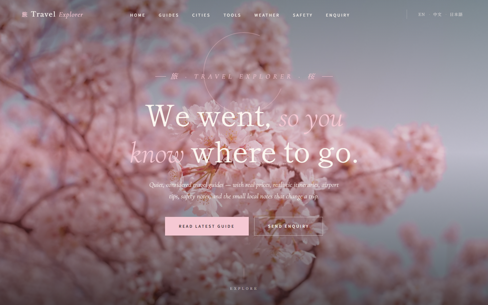

# Travel Explorer 旅

> **We went, so you know where to go.**

A single-page travel discovery site in a Japanese Zen aesthetic — sakura pinks on washi paper, sumi-ink type, generous whitespace. Curated city guides, interactive travel tools, an offline climate snapshot, safety notes, and a contact form. Built with **pure HTML, CSS, and JavaScript** — no frameworks, no backend, no API keys.

🌐 **Live demo:** [brennantan-coder.github.io/Travel-Explorer-BT](https://brennantan-coder.github.io/Travel-Explorer-BT/)

---

## Preview



---

## Features

### 12 Curated City Guides
Seoul · Singapore · Bali · Tokyo · Bangkok · Hong Kong · Kuala Lumpur · Maldives · Phuket & Krabi · Sydney · Taipei · Hanoi

Each guide includes:
- Destination overview & ambience
- Detailed 3-day itineraries
- Must-try local foods
- Transport & getting-around tips
- Estimated cost breakdown (flights, hotels, food)
- Safety advice
- Best photo spots

### Interactive Travel Tools
- **Trip Budget Calculator** — destination x travellers x days x daily spend
- **Packing Checklist** — 5 categories, persists in `localStorage`
- **Itinerary Planner** — add/delete activities by day, persists in `localStorage`

### Climate Snapshot (offline)
Seasonal climate averages for all 12 destinations — temperature, humidity, wind, feels-like. Fully offline, no API key, no network call. Quick-pick buttons for every featured city.

### Safety Section
Three-tier safety ratings (safe / moderate / caution) for all 12 destinations with key tips and emergency contact numbers.

### Enquiry Form
Validated contact form with email regex check, success state, and `localStorage` persistence.

### Design
- **Japanese Zen, pinkish** — sakura blush on washi rice paper
- Display type: **Shippori Mincho B1** + **Noto Serif JP**; refined italic accents in **Cormorant Garamond**; UI in **Noto Sans JP**
- Sumi-ink black with sakura / washi / kinari accent palette
- Subtle enso (circle) accent on the hero, hairline rules between sections
- Cinematic Unsplash imagery, gently desaturated
- Fully responsive (mobile, tablet, desktop)
- Smooth scroll, fade-in modals, hover transitions

---

## Getting Started

### Option 1 — Open directly
Simply double-click `index.html` to open it in your browser. That's it.

### Option 2 — Local server
```powershell
cd "path\to\Travel"
python -m http.server 8080
```
Then open [http://localhost:8080](http://localhost:8080)

> No API keys, no `.env`, no setup. The climate snapshot ships with the page.

---

## Project Structure

```
Travel/
├── index.html                  # The entire app (HTML + CSS + JS)
├── README.md                   # This file
├── .mcp.json                   # Playwright MCP server config (dev tooling)
└── .github/
    └── workflows/
        └── deploy.yml          # GitHub Actions → Pages deployment
```

---

## Deployment (GitHub Actions)

This repository auto-deploys to GitHub Pages on every push to `main` via the workflow in [`.github/workflows/deploy.yml`](.github/workflows/deploy.yml).

**Workflow steps:**
1. Checkout the repo
2. Configure GitHub Pages
3. Upload the entire repo as a Pages artifact
4. Deploy to GitHub Pages

**To enable on a fork:**
1. Go to **Settings → Pages**
2. Under **Source**, select **GitHub Actions**
3. Push to `main` — the workflow runs automatically

---

## Tech Stack

| Layer | Tech |
|---|---|
| Markup | HTML5 |
| Styling | CSS3 (Grid, Flexbox, custom properties) |
| Logic | Vanilla JavaScript (ES6+) |
| Fonts | Google Fonts — Shippori Mincho B1, Noto Serif JP, Cormorant Garamond, Noto Sans JP |
| Imagery | Unsplash |
| Climate | Offline seasonal snapshot (no API) |
| Persistence | Browser `localStorage` |
| Hosting | GitHub Pages |
| CI/CD | GitHub Actions |

---

## License

Open source — feel free to fork, learn from, and adapt for your own travel projects.

---

**Built with care by [@brennantan-coder](https://github.com/brennantan-coder)**
